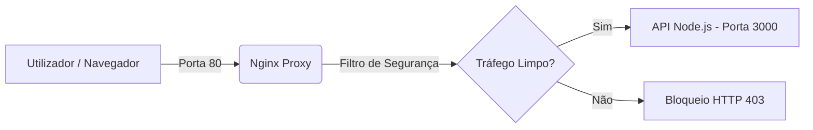

# HTTP Proxy Reverso com Nginx e Node.js

Este projeto demonstra a implementação de uma arquitetura de rede segura para aplicações web. Ele utiliza o **Nginx** como um Proxy Reverso focado em segurança e performance, protegendo uma API desenvolvida em **Node.js**.

O objetivo principal é simular um cenário real de produção, onde a aplicação de backend fica totalmente isolada da internet pública, recebendo apenas tráfego previamente verificado.

## 🛡️ Funcionalidades do Projeto

* **Proxy Reverso:** O Nginx recebe todas as requisições públicas na porta `80` e as encaminha internamente para o Node.js.
* **Filtro de Segurança periférico:** Bloqueio automático de tentativas comuns de injeção de código (como `<script>` ou comandos SQL) diretamente na entrada da rede.
* **Isolamento de Infraestrutura:** A aplicação Node.js roda escondida dentro de uma rede privada do Docker, tornando impossível o acesso direto ao backend sem passar pelo proxy.

## 🏗️ Arquitetura do Sistema



## 🚀 Como Executar

### Pré-requisitos
* [Docker](https://docker.com) instalado na máquina.

### Passo a Passo
1. Clone este repositório:
   ```bash
  https://github.com/MauricioRomao/http-proxy
   ```
2. Entre na pasta do projeto:
   ```bash
   cd http-proxy
   ```
3. Inicie os servidores com o Docker Compose:
   ```bash
   docker-compose up --build
   ```

O Proxy estará ativo e pronto para receber conexões no  `http://localhost:3000/`.

## 🧠 Aprendizados Académicos
Este projeto foi desenvolvido com foco em estudos de infraestrutura de software e segurança defensiva, consolidando conceitos de:
* Separação de conceitos entre código de negócio (Node.js) e regras de rede (Nginx).
* Conteinerização de aplicações com Docker e isolamento de redes internas.
